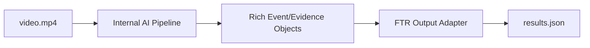

# FTR Results Output Contract

Bu contract, TEKNOFEST 2026 5G ve Yapay Zeka ile Akilli Yol Guvenligi Yarismasi
FTR asamasi otomatik degerlendirme ciktisi icin kullanilir.

Mevcut `architecture/contracts/event.schema.json` proje ici evidence/risk semasidir.
FTR tesliminde hakem scriptinin bekledigi dosya ise ayridir:

```text
/app/data/output/results.json
```

## 1. Dosya Konumu

* Input video: `/app/data/input/video.mp4`
* Output JSON: `/app/data/output/results.json`
* Model agirliklari: `/app/models/`

## 2. Konsolide JSON

```json
{
  "video_id": "video.mp4",
  "arac_bilgisi": {
    "tip": "sedan",
    "plaka": "34ABC123",
    "renk": "beyaz",
    "confidence_score": 0.94
  },
  "tespitler": [
    {
      "zaman_saniye": 14.5,
      "kategori": "sofor_eylemi",
      "etiket": "telefonla_konusma",
      "confidence_score": 0.89
    }
  ]
}
```

## 3. `arac_bilgisi`

| Alan | Tip | Gecerli degerler |
|---|---|---|
| `tip` | string | `sedan`, `suv`, `hatchback`, `pickup`, `minibus`, `panelvan`, `kamyon` |
| `plaka` | string | Turkiye plaka regex uyumlu normalize metin, or. `34ABC123` |
| `renk` | string | `beyaz`, `siyah`, `gri`, `kirmizi`, `mavi`, `sari`, `yesil`, `turuncu`, `kahverengi` |
| `confidence_score` | float | 0.0-1.0 |

Plaka regex referansi:

```text
^(0[1-9]|[1-7][0-9]|8[01])((\s?[a-zA-Z]\s?)(\d{4,5})|(\s?[a-zA-Z]{2}\s?)(\d{3,4})|(\s?[a-zA-Z]{3}\s?)(\d{2,3}))$
```

Output icin bosluklar normalize edilip `34ABC123` gibi birlesik format tercih edilir.
Gecersiz/dusuk guvenli plaka degeri final skora zarar verebilecegi icin adapter icinde
ayri fallback policy tanimlanmalidir.

## 4. `tespitler`

Her tespit su alana sahiptir:

| Alan | Tip | Not |
|---|---|---|
| `zaman_saniye` | float | Video icindeki saniye |
| `kategori` | string | `sofor_eylemi`, `nesneler`, `yolcular` |
| `etiket` | string | Kategoriye gore izinli etiket |
| `confidence_score` | float | 0.0-1.0 |

### 4.1 `sofor_eylemi`

* `arkaya_bakma`
* `esneme`
* `sigara_icme`
* `su_icme`
* `telefonla_konusma`
* `slalom`
* `etrafa_bakinma`
* `emniyet_kemeri_ihlali`

### 4.2 `nesneler`

* `teknocan`
* `bilgisayar`

### 4.3 `yolcular`

* `arka_koltuk_1`
* `arka_koltuk_2`
* `on_koltuk`

## 5. Adapter Kurali

Runtime pipeline daha zengin event/evidence nesneleri uretebilir. Fakat FTR submission icin
son adimda yalniz bu contract'a uygun, ASCII-safe ve kucuk harfli etiketlerden olusan
`results.json` yazilmalidir.



## 6. Validator Gereksinimi

Submission oncesi lokal validator su kontrolleri yapmalidir:

* Zorunlu key'ler var mi?
* Tum confidence degerleri 0.0-1.0 arasinda mi?
* Tum kategori ve etiketler izinli listelerde mi?
* Etiketlerde Turkce karakter veya buyuk harf var mi?
* `arac_bilgisi.plaka` regex'e uyuyor mu veya fallback policy uygulanmis mi?
* Dosya UTF-8 JSON olarak yaziliyor mu?
