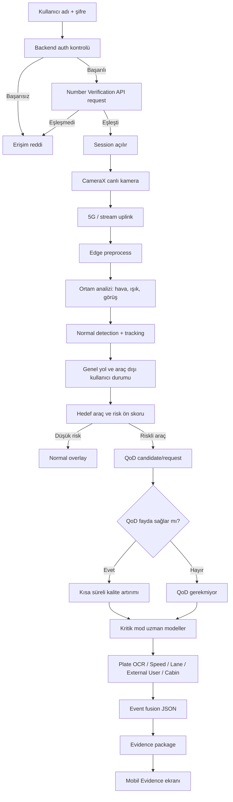

# Auth, Normal Mode and QoD Flow

Bu akış, `leD24n5kb...pdf` ve güncel proje kararlarına göre ana çalışma sırasını gösterir.

## Notlar

* QoD tetikleme, her riskte otomatik aktiflik anlamına gelmez.
* Ortam analizi detection kararını tek başına değiştirmez; risk skoruna ve model güven yorumuna bağlam sağlar.
* Araç dışı kullanıcı/yaya durumu ilk aşamada public/pretrained detection sınıflarıyla temsil edilebilir.
