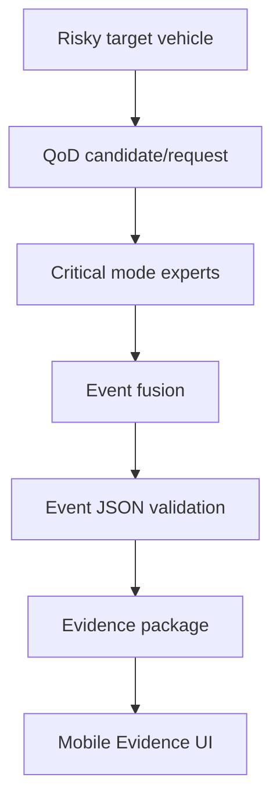

# Evidence Generation Flow

```mermaid
flowchart TD
  A["Risky target vehicle"] --> B["QoD candidate/request"]
  B --> C["Critical mode experts"]
  C --> D["Event fusion"]
  D --> E["Event JSON validation"]
  E --> F["Evidence package"]
  F --> G["Mobile Evidence UI"]
```
