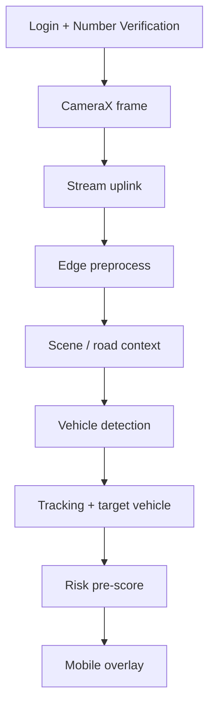

# Live Inference Flow

```mermaid
flowchart TD
  A["Login + Number Verification"] --> B["CameraX frame"]
  B --> C["Stream uplink"]
  C --> D["Edge preprocess"]
  D --> E["Scene / road context"]
  E --> F["Vehicle detection"]
  F --> G["Tracking + target vehicle"]
  G --> H["Risk pre-score"]
  H --> I["Mobile overlay"]
```
