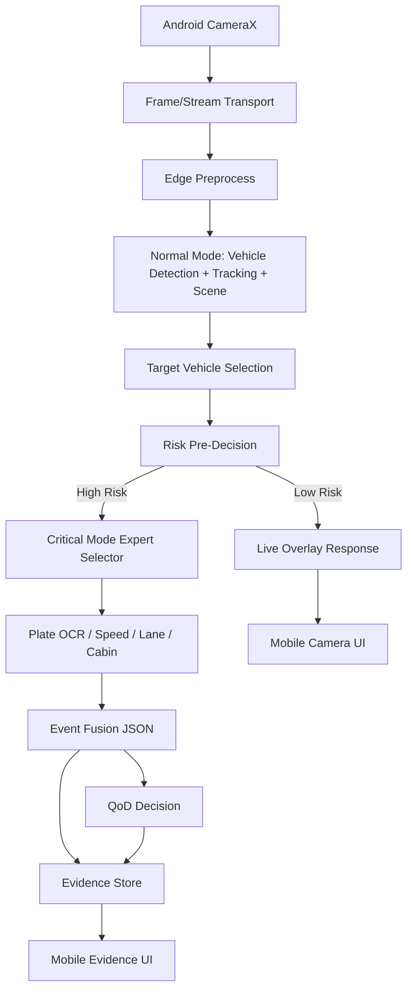

# Uçtan Uca Sistem Mimarisi

## Ana Bileşenler

1. **Mobile Client:** Kamera, UI, overlay, evidence ekranları.
2. **Transport Layer:** Frame/stream aktarımı.
3. **Edge Inference Server:** AI modellerinin çalıştığı backend.
4. **Mode Orchestrator:** Normal/kritik mod karar mantığı.
5. **Expert Models:** OCR, speed, lane, cabin risk gibi uzman modüller.
6. **QoD/5G Adapter:** Number Verification ve QoD servis entegrasyonu.
7. **Evidence Store:** Görsel kesit, screenshot ve JSON metadata.
8. **Explanation Layer:** Structured JSON çıktısından insan okunur açıklama.

## Veri Akışı

## Darboğaz Kontrolü

* Araç tespiti ve tracking normal modda önceliklidir.
* OCR ve cabin risk her frame’de çalışmaz.
* Scene analysis düşük frekanslı olabilir.
* Evidence sadece olay bazlı üretilir.
* QoD yalnız aday olduğunda çağrılır.

## Ana Tasarım Kararı

Edge/backend tarafı ağır çıkarımı üstlenir; mobil taraf kamera, kullanıcı deneyimi ve sonuç gösterimini üstlenir. Bu ayrım mobil cihaz kaynaklarını korur.
