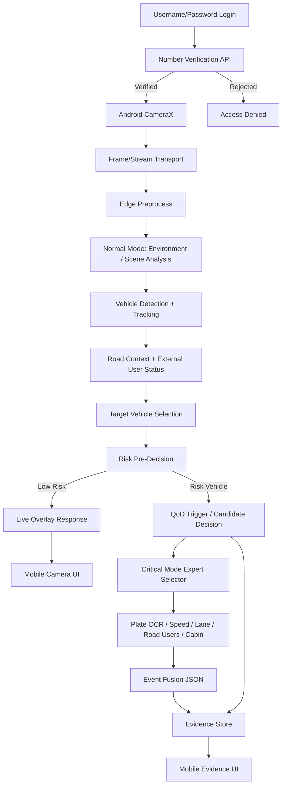

# Uçtan Uca Sistem Mimarisi

## Ana Bileşenler

1. **Login/Auth Client:** Kullanıcı adı/şifre girişi ve oturum başlatma.
2. **Number Verification Adapter:** Kullanıcı/cihaz/oturum eşleşmesini doğrulayan API entegrasyonu.
3. **Mobile Client:** Kamera, UI, overlay, evidence ekranları.
4. **Transport Layer:** Frame/stream aktarımı.
5. **Edge Inference Server:** AI modellerinin çalıştığı backend.
6. **Mode Orchestrator:** Normal/kritik mod karar mantığı.
7. **Expert Models:** OCR, speed, lane, road/external user ve cabin risk gibi uzman modüller.
8. **QoD/5G Adapter:** Riskli araç özelinde QoD aday/request/aktif durumlarını yöneten servis entegrasyonu.
9. **Evidence Store:** Görsel kesit, screenshot ve JSON metadata.
10. **Explanation Layer:** Structured JSON çıktısından insan okunur açıklama.

## Veri Akışı

## Darboğaz Kontrolü

* Login sonrası Number Verification doğrulanmadan canlı analiz ekranı açılmaz.
* Ortam/sahne analizi normal modun erken bağlam sinyalidir.
* Araç tespiti ve tracking normal modda önceliklidir.
* Genel yol ve araç dışı kullanıcı/yaya durumu risk skoruna bağlamsal katkı sağlar.
* OCR ve cabin risk her frame’de çalışmaz.
* Scene analysis düşük frekanslı olabilir.
* Evidence sadece olay bazlı üretilir.
* QoD riskli araç için tetiklenen aday/request akışıyla değerlendirilir; yalnız karar güveni veya kanıt kalitesi artacaksa aktif olur.

## Ana Tasarım Kararı

Edge/backend tarafı ağır çıkarımı üstlenir; mobil taraf kamera, kullanıcı deneyimi ve sonuç gösterimini üstlenir. Bu ayrım mobil cihaz kaynaklarını korur.
