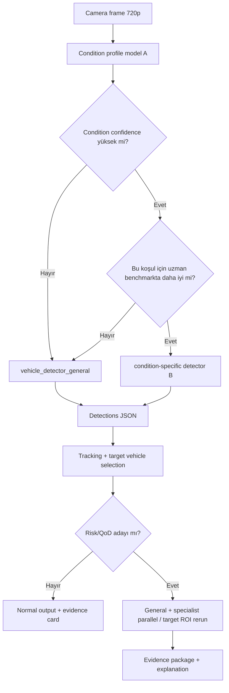

# Anomali Road Safety AI için Koşul Uzmanları Yaklaşımı

## Yönetici özeti

Bu proje için en uygulanabilir seçim **Strateji 1**’dir: önce güçlü bir **genel araç dedektörü** kurup benchmark’lamak, sonra yalnızca ölçülebilir biçimde üstünlük gösteren koşullar için **sınırlı sayıda uzman dedektör** eklemek. Gerekçe şu: adverse-weather/domain-shift literatürü, tek “all-weather” eğitiminin koşullar arası dağılım çatışmalarına açık olduğunu; buna karşılık koşul-yönlendirmeli uzmanlaşmanın doğru routing ile kazanç sağlayabildiğini gösteriyor. Ancak doğrudan tüm uzmanları ayrı eğitmek veri parçalanması, yanlış routing ve runtime karmaşıklığını çok artırır. Bu nedenle MVP’de sıra: `vehicle_detector_general` → `vehicle_detector_dark/night_low_light` → gerekirse `rain` ve `fog_low_visibility`; **general fallback** her zaman açık kalmalı, preprocessing/enhancement ise ana hat değil, challenger hat olmalıdır. Bu yaklaşım, repo’daki MVP/modül sırası ve rapor odaklı ilerleme mantığıyla da uyumludur. citeturn21academia0turn16academia0turn16academia2turn23academia0turn32academia2turn49view0 fileciteturn0file0 fileciteturn0file1 fileciteturn0file2 fileciteturn0file3

## Kavramsal çerçeve ve strateji seçimi

“Koşul uzmanı”, yalnızca `dark/rain/fog` etiketi döndüren bir çevre sınıflandırıcısı değildir; doğrudan **aynı araç tespiti görevini** yapan fakat belirli koşula özel fine-tune edilmiş ayrı detector profilidir. Bu ayrım önemlidir: **A modeli** koşulu tahmin eder, **B modeli** aracı bulur. Literatürde adverse weather altında tek model performans düşüşü, weather-aware routing, domain-specialized experts ve joint enhancement/detection gibi üç ana çizgi görülür; özellikle yakın tarihli MoE/detectör uzmanlaşması çalışmaları, farklı hava/aydınlatma dağılımlarını tek modelde zorla birleştirmenin “training conflict” yaratabildiğini gösterir. citeturn21academia0turn22academia3turn21academia1turn14academia3

**Strateji 1** için önerilen uygulama sırası şöyledir: önce `yolo11n` veya `yolo11s` benzeri bir genel dedektör; ardından koşul-altkümelerinde anlamlı üstünlük gösterirse uzmanlar. Bu yöntem veri verimliliği, fallback tasarımı ve repo yönetimi açısından en güvenli yoldur. **Strateji 2** yani doğrudan uzmanlarla başlamak, her uzman için yeterli gerçek veri, ayrı test protokolü ve güvenilir routing gerektirir; mevcut durumda bu, özellikle yalnızca üç lokal dark video varken, aşırı risklidir. **Strateji 3** yani tek all-weather model + augmentation/preprocessing, düşük operasyon yükü nedeniyle değerli bir baseline/challenger’dır; fakat gerçek adverse-condition domain gap’ini tek başına kapatacağı varsayılmamalıdır. Physics-based rain/fog augmentations ve sentetik setler faydalı olabilir, ama fazla agresif kullanım unutma/uyumsuzluk doğurabilir; low-light enhancement modülleri de kazanç sağlasa bile latency ve bakım maliyeti ekler. citeturn16academia0turn16academia2turn26academia1turn21academia2turn23academia0turn23academia1turn32academia2

Bu nedenle proje için önerilen expert listesi şudur: **zorunlu** `vehicle_detector_general`; **ilk uzman** `vehicle_detector_dark` ve/veya `vehicle_detector_night_low_light`; **ikinci dalga** `vehicle_detector_rain`, `vehicle_detector_fog_low_visibility`; **araştırma/sonraki aşama** `glare`, `low_contrast`, `tunnel_or_parking_dark`. `glare` ve `tunnel_dark` için kamu verisi daha zayıf olduğu için bunlar başlangıçta ayrı detector değil, condition label ve ROI/preprocessing ile ele alınmalıdır. citeturn14academia1turn25academia3turn16academia1turn27academia3turn34academia2



## Veri ve koşul etiketleme planı

Aşağıdaki envanter, **condition-specific fine-tune** ve **external test** için en pratik açık veri kaynaklarını özetler. “Lisans” sütununda resmi kullanım şartı açıkça görülemeyenler özellikle işaretlenmiştir; yarışma raporu ve olası ticarileşme için her veri seti ayrıca doğrulanmalıdır. citeturn10view0turn52view0turn13view0turn55view0turn56view1turn13view3

| Veri seti | Tip / ölçek | Araç bbox | Koşul etiketi | Lisans / erişim | Uzman kullanımı |
|---|---|---|---|---|---|
| COCO citeturn10view0turn54view0 | görüntü, genel amaçlı | var | koşul etiketi zayıf | resmi site/terms; kullanım şartı doğrulanmalı | yalnızca genel pretraining/fallback |
| BDD100K citeturn27academia3turn52view0 | 100K sürüş videosu, çok görevli | var | çevresel/hava çeşitliliği güçlü | BSD-3-Clause toolkit; veri şartları ayrıca doğrulanmalı | **genel + night/rain etiket türetimi için en güçlü ana kaynak** |
| KITTI citeturn10view2 | görüntü/video, klasik ADAS | var | koşul çeşitliliği sınırlı | resmi KITTI şartları | genel test/ek fine-tune |
| UA-DETRAC citeturn15academia3 | sabit trafik kamerası video | var | hava/yoğunluk/senaryo bilgisi var, kaynak lisansı doğrulanmalı | lisans doğrulanmalı | **sabit kamera domain’i** için çok değerli |
| Cityscapes citeturn13view0 | 5K fine + 20K coarse | 2D/3D araç bilgisi sınırlı ama güçlü | kötü hava az | non-commercial | genel domain adaptation, doğrudan uzman ana kaynak değil |
| nuScenes / nuImages citeturn28academia0turn55view0 | 1000 sahne, çok sensör | 3D güçlü, 2D türetilebilir | öznitelik ve koşul çeşitliliği var | Terms of Use / hesap gerekli | external robustness, 2D dönüştürme emekli |
| Waymo Open citeturn29academia3turn56view1 | büyük ölçekli perception dataset | 2D+3D | çeşitli koşullar | **non-commercial terms** | güçlü external test, Colab için ağır |
| AI City / CityFlow citeturn13view3turn58academia0 | trafik kamerası video | var | koşul yılına göre değişir | track bazlı şartlar | sabit kamera, multi-camera dış test |
| ACDC citeturn14academia1 | 8012 görüntü | detection destekli | **fog/night/rain/snow** açık | site var; lisans doğrulanmalı | **uzman alt-kümeler için çok değerli** |
| DAWN citeturn15academia3turn25academia3 | 1000 gerçek adverse-weather görüntü | var | **fog/rain/snow/sandstorm** | lisans doğrulanmalı | condition test ve küçük fine-tune |
| Foggy Cityscapes / Foggy Zurich citeturn17academia1turn17academia2 | sentetik+gerçek sis | doğrudan detection için bazı türevlerde kullanılır | fog yoğunluğu | Cityscapes türevi, lisans doğrulanmalı | **fog uzmanı** için yardımcı |
| VisDrone citeturn31academia1turn43view0 | drone görüntü/video | var | koşul etiketi zayıf | repo açık, koşullar doğrulanmalı | küçük/uzak araç robustness testi |
| Dark Zurich citeturn15academia1 | gece/twilight görüntüleri | segmentation ağırlıklı | **night/twilight** | proje sitesi/terms | classifier + external night test |
| ExDark citeturn33academia0 | low-light görüntü seti | var | **10 low-light tipi** | GitHub erişimli; kullanım şartı doğrulanmalı | **dark uzmanı** için yardımcı, fakat driving-domain gap var |
| DarkVision / DarkDriving citeturn20academia3turn14academia0 | low-light görüntü/video | detection benchmark | çoklu aydınlatma | erişim/lisans doğrulanmalı | night/dark research challenger |
| RaidaR citeturn16academia1 | rainy street scenes | maske güçlü, bbox türetilebilir | **rain artifacts** | kullanım şartı doğrulanmalı | rain classifier/preprocessing daha uygun |
| SHIFT / A-BDD / sentetik yağmur-sis setleri citeturn60academia0turn26academia1turn16academia0turn16academia2 | sentetik/augment | annotation mevcut ya da türetilebilir | rain/fog/cloudiness/time | kaynak bazlı doğrulama | augmentation ve robustness için iyi, ana gerçek-test yerine geçmez |
| CARLA / GTA tabanlı sim citeturn59view0 | simülasyon | bbox erişilebilir | hava/ışık tam kontrol | açık sim; veri politikasını proje bazında tanımla | veri açığı kapatma, kritik durum sentezi |

Bu tabloya göre **genel dedektör** için ilk veri omurgası `BDD100K + (gerekiyorsa) COCO`, **dark/night** için `BDD100K night + ACDC night + ExDark(vehicle-only)`, **rain** için `BDD100K rainy + ACDC rain + DAWN rain (+ sentetik A-BDD/RaidaR türevleri)`, **fog** için `ACDC fog + DAWN fog + Foggy Cityscapes/Foggy Zurich` olmalıdır. Türkiye’ye özgü, açık lisanslı, condition-etiketli ve güçlü bbox yoğunluklu bir veri seti bu taramada öne çıkmadı; bu yüzden kontrollü yerel çekim ve manuel etiketleme orta vadede gerekecektir. citeturn27academia3turn14academia1turn25academia3turn33academia0turn17academia1turn17academia2

Veri mühendisliği tarafında sizin üç dark videonuz **training** için kullanılmamalı; yalnızca smoke test ve final demo external sanity set olarak tutulmalı. Kendi videolarınızdan frame çıkarırken **video-level split** şarttır; aynı videodan gelen kareler train/val/test’e dağılmamalıdır. Başlangıç için **0.5 saniyede bir frame** güvenli bir örnekleme hızıdır; tekrar eden ardışık kare sızıntısını azaltır. Etiketleme için CVAT/Label Studio/Roboflow kullanılabilir; sınıf şeması sabit tutulmalı: `{car, bus, truck, motorcycle}`. `van/minibus/pickup/suv` gibi etiketler net bir mapping kuralı ile çoğunlukla `car` veya `truck`a indirgenmeli; `person/bicycle/rider` bu modülde tutulmamalı, ayrı dış-yol-kullanıcısı modülüne bırakılmalıdır. citeturn49view0

Augmentation tarafında öneri şudur: genel modelde hafif ve doğal bozucu artırmalar; uzman modelde koşula özgü artırmalar. `dark` için gamma düşürme, exposure jitter, noise, blur; `rain` için streak/reflection/wet-road; `fog` için contrast düşürme ve haze. Ancak agresif augmentation, küçük/uzak araç sınırlarını bozabilir; özellikle son uzman fine-tune aşamasında overly strong mosaic/mixup azaltılmalıdır. Synthetic rain/fog/night augmentations yararlıdır, fakat kabul kararı yalnızca **gerçek adverse subset** üzerinde verilmelidir. citeturn16academia0turn16academia2turn26academia1turn21academia2turn23academia1

## Koşul profili modeli ve uzman dedektörler

Koşul profili modeli için amaç “hava durumu tahmini” değil, routing kararıdır. Bu yüzden A modeli hafif ve hiyerarşik olmalıdır: `illumination`, `weather`, `visibility`, `glare` alanlarını ayrı ama ilişkili tahmin eden küçük bir classifier yeterlidir. WeatherNet, yol görüntülerinden day/night, glare, clear/rain/fog/snow gibi görsel koşulların CNN tabanlı biçimde ayrıştırılabileceğini göstermiştir; MobileNetV3 ise mobil/edge verimliliği için tasarlanmıştır, ConvNeXt ise daha güçlü ama ağır bir sınıflandırıcı tabandır. Bu projede öneri, **MVP için MobileNetV3-Small/Large veya ResNet18**, sonraki aşamada gerekirse **ConvNeXt-Tiny** challenger kullanmaktır. citeturn34academia2turn34academia0turn35academia0

Önerilen A-çıktısı şöyledir:

```json
{
  "frame_id": 1520,
  "condition_profile": "night_low_light",
  "condition_confidence": 0.88,
  "illumination": "night_low_light",
  "weather": "clear",
  "visibility": "medium",
  "glare": false,
  "model_version": "condition_profile_mobilenetv3_v1"
}
```

A modeli her frame’de koşmamalıdır; ortam çoğu zaman kareler arasında yavaş değişir. Bu nedenle **2 Hz** civarı koşul tahmini, son **5 tahmin üzerinde EMA/hysteresis**, ve ancak `condition_confidence >= 0.75` ve `top1-top2 margin >= 0.15` ise routing değişimi önerilir. Bu, yanlış uzman çağrısını azaltır. Düşük güven, hızlı exposure değişimi ya da çelişen etiket durumda sistem doğrudan `vehicle_detector_general`a dönmelidir. Bu eşikler proje politikasıdır; cihaz üzerinde ölçülerek ayarlanmalıdır. citeturn21academia0turn34academia2

Uzman dedektör tarafında ilk aday aile **Ultralytics YOLO11n/s**’dir. Gerekçesi, hazır pretrained ağırlıklar, eğitim/val/export zincirinin olgunluğu ve çoklu export hedefleridir. YOLO11 docs, `yolo11n` ve `yolo11s` için COCO üzerinde güçlü accuracy-speed noktaları ve detection/train/export desteği veriyor; lisans tarafında AGPL-3.0/enterprise ayrımı net. **YOLOv8n/s** stabil fallback; **YOLOv10n/s** ise NMS-free tasarım sayesinde latency odaklı challenger’dır ve belgeye göre export destekleri ONNX/OpenVINO/TensorRT/CoreML/TFLite yönünde mevcuttur. RT-DETR ise “accuracy challenger” olabilir, fakat ilk specialist deneyleri için daha ağır bir seçenek olarak kalmalıdır. citeturn62view0turn62view1turn37view0turn38view1turn38view2turn63view2

Pratik model önerisi şu sıradadır: `vehicle_detector_general_yolo11n_v1` ile başla; bunu `yolo11s` ve `yolov10n` ile benchmarkla. Eğer dark subset’te `yolo11n` iyi ise dark uzmanı da aynı aileden türet; eğer recall düşük kalırsa `yolo11s` dark uzmanı olarak kabul edilebilir. Uzman modelin biraz daha büyük olması makuldür, çünkü tüm frame akışında değil, routing ile koşacaktır; yine de MacBook local runtime için aynı anda çok sayıda aktif büyük model tutulmamalıdır. İlk MVP’de **genel + tek uzman** yeterlidir. citeturn62view0turn38view1turn49view0

Örnek fine-tune reçetesi, `vehicle_detector_dark` için şöyledir: başlangıç ağırlığı `yolo11n.pt`; veri `BDD100K-night + ACDC-night + ExDark(vehicle-filtered)`; giriş `640`; `50–100 epoch`, early stopping; standard Ultralytics optimizer/config ile başla; augment olarak brightness-contrast-gamma, sensor noise, blur, düşük kontrast, hafif motion blur kullan; validation ve test split’leri video-level ayrılmış olsun; lokal üç dark video yalnızca external smoke testte kalsın. `rain` ve `fog` uzmanları için aynı reçete veri ve augmentation bazında değiştirilir. `small/far vehicle` sorunu varsa önce yol ROI crop ve daha yüksek `imgsz` challenger denenmeli; mimariyi P2-head düzeyinde karmaşıklaştırmak ilk sprintte gerekli değildir. citeturn27academia3turn14academia1turn33academia0turn16academia0turn16academia2

## Yönlendirme, benchmark ve çalışma zamanı

Routing politikası için güvenli kural: **general daima var**, specialist yalnızca “kanıtlanmış üstünlük + yüksek koşul güveni” durumunda devreye girer. Aynı frame’de hem general hem specialist çalıştırmak normal modda pahalıdır; bunu yalnızca **QoD adayı**, **riskli araç**, **genel model düşük güven**, ya da **koşul sınıfı kararsız** durumunda kullanın. Normal modda tek model; kritik modda hedef ROI üzerinde ikinci geçiş daha mantıklıdır. Bu, kullanıcı akışındaki sürekli normal izleme ile kontrollü QoD maliyeti fikrine de uygundur. citeturn21academia0turn49view0

Örnek politika dosyası:

```json
{
  "default_detector": "vehicle_detector_general_yolo11n_v1",
  "switch_hysteresis_frames": 5,
  "min_condition_confidence": 0.75,
  "min_condition_margin": 0.15,
  "fallback_on_low_confidence": true,
  "experts": {
    "night_low_light": "vehicle_detector_dark_yolo11n_v1",
    "dark": "vehicle_detector_dark_yolo11n_v1",
    "rain": "vehicle_detector_rain_yolo11n_v1",
    "fog_low_visibility": "vehicle_detector_fog_yolo11n_v1"
  },
  "critical_mode": {
    "enable_parallel_general_specialist": true,
    "only_for_target_roi": true,
    "trigger_if_detection_conf_lt": 0.45
  }
}
```

Uzman kabulü için önerilen eşik proje-politikası olarak şudur: bir specialist, kendi hedef alt-kümesinde general modele göre **en az +3 mutlak Recall veya F1 artışı** ya da **missed detection/min metriklerinde en az %15 iyileşme** sağlamalı; bu sırada **latency artışı %25’i geçmemeli** ve doğru routing altında non-target koşullarda belirgin kötüleşme olmamalıdır. Aksi halde specialist reposu şişirir ama ürün değerini artırmaz. Bu eşik, adverse-condition routing’in ek bakım ve model yönetim maliyetini dengelemek için pratiktir. citeturn21academia0turn21academia2turn22academia3

Benchmark protokolü yalnızca mAP ile sınırlanmamalıdır. Asgari metrik seti: `mAP@0.5`, `mAP@0.5:0.95`, precision, recall, F1; ayrıca **bbox IoU dağılımı** (P50/P75), **false positive/min**, **missed detection/min**, **confidence stability** (aynı track boyunca güven skorunun oynaklığı), **track continuity score** (GT track uzunluğu boyunca iz sürekliliği) ve **fragmentation count** tutulmalıdır. Düşük ışık manuel review checklist’i de şarttır: uzak far/arka lamba kaynaklı ghost box, park halindeki koyu araçların kaçırılması, ıslak zeminde yansıma çiftlemesi, box’ın aracın gerçek gövdesini değil gölgeyi sarması, motosiklet-bisiklet-karanlık insan karışmaları. Bunlar takip ve hedef araç seçiminde doğrudan aşağı akış hatası üretir. citeturn49view0turn14academia3turn21academia2

Runtime tarafında MacBook local edge için en gerçekçi yol, önce **ONNX Runtime** ile deterministik CPU/Apple testleri, sonra Apple cihazlarda **CoreML Execution Provider** denemektir. ONNX Runtime belgeleri, CoreML EP’nin macOS üzerinde çalıştığını, Apple donanımından faydalandığını ve **static input shapes** ile daha iyi performans verdiğini açıkça söylüyor; ayrıca CoreML/ONNX/OpenVINO/TensorRT/TF Lite export zinciri modern YOLO hattında destekleniyor. Bu yüzden registry her model için `onnx`, gerekirse `coreml` exportunu saklamalı; `FP16` önce, `INT8` ise temsilî calibration seti ile ikinci aşamada ölçülmelidir. citeturn45view0turn63view2turn38view2turn64view1

Model registry önerisi:

```json
{
  "model_id": "vehicle_detector_dark_yolo11n_v1",
  "task": "vehicle_detection",
  "condition_profile": "night_low_light",
  "classes": ["car", "bus", "truck", "motorcycle"],
  "weights_pt": "models/weights/vehicle_detector_dark_yolo11n_v1.pt",
  "weights_onnx": "models/exports/vehicle_detector_dark_yolo11n_v1.onnx",
  "weights_coreml": "models/exports/vehicle_detector_dark_yolo11n_v1.mlpackage",
  "status": "candidate",
  "benchmark_proven_better_than_general": false,
  "latency_ms_edge": "ölçülmeli",
  "license_notes": "Ultralytics AGPL-3.0 / enterprise değerlendirmesi gerekli"
}
```

## Sprint planı, riskler ve repo çıktıları

**Sprint 1:** `vehicle_detector_general_yolo11n_v1` kurulumu, BDD100K/COCO veri dönüşümü, benchmark template, event JSON sözleşmesi. **Sprint 2:** condition classifier v1 (`day/night/rain/fog/uncertain`), dark-night veri alt-kümesi ve `vehicle_detector_dark` fine-tune. **Sprint 3:** expert routing, fallback, hysteresis, external smoke test (3 dark video), manüel review formu. **Sprint 4:** rain/fog specialist adayları, MacBook edge latency/quantization/export denemeleri, evidence ve registry entegrasyonu. Uzun vadede glare, tunnel_dark ve preprocessing challenger hattı eklenebilir. Repo zaten `architecture/`, `backend/`, `docs/`, `models/`, `research/`, `testing/` gibi bu yapıya uygun klasörler içeriyor. citeturn49view0

Önerilen dosyalar:
`research/condition_experts/README.md`,
`research/condition_experts/strategy_comparison.md`,
`research/condition_experts/dataset_inventory.csv`,
`research/condition_experts/benchmark_protocol.md`,
`research/condition_experts/condition_classifier.md`,
`research/condition_experts/specialist_acceptance_policy.md`,
`architecture/contracts/expert_routing_policy.example.json`,
`architecture/flows/condition_expert_runtime.mmd`,
`docs/04_yapay_zeka/condition_experts.md`,
`models/registry/condition_experts.registry.json`,
`models/experiments/vehicle_detector_dark_experiment.md`,
`testing/benchmarks/condition_experts_benchmark_template.csv`,
`notebooks/vehicle_detector_dark_finetune_v1.ipynb`. Bunlar, repodaki mevcut planlama/dokümantasyon odaklı iskelete doğal biçimde oturur. citeturn49view0

Colab notebook iskeleti şu minimal akışla kurulmalıdır: ortam kurulumu; veri indirme/dönüştürme; sınıf mapping; video-level split; `yolo11n.pt` ile general veya dark fine-tune; validation; held-out test; ONNX export; örnek inference ve confusion output; metriklerin `results.json` ve `benchmark.csv` olarak kaydı. Yerel video seti sadece notebook sonunda smoke test olarak okunmalı. KVKK/not güvenlik tarafında plakalar ve sürücü siluetleri kişisel veri riski doğurabilir; bu nedenle raw video yerine kontrollü erişim, kırpılmış evidence saklama, yetki matrisi ve veri minimizasyonu uygulanmalıdır; hukuki kullanım çerçevesi ayrıca doğrulanmalıdır. citeturn49view0

Temel risk kaydı şöyledir: **yanlış koşul sınıflandırması** → fallback+hysteresis; **küçük lokal videolara overfit** → train’e almama; **sentetik augmentation uyumsuzluğu** → acceptance’ı gerçek testte verme; **latency/memory patlaması** → aynı anda max 1 general + 1 specialist warm; **lisans belirsizliği** → dataset whitelist; **non-target koşul bozulması** → specialist kabul eşiği; **yanlış pozitiflerin uzman modülleri gereksiz tetiklemesi** → risk/QoD eşiği; **yanlış negatiflerin plaka/takip zincirini kırması** → recall ve continuity metriğini zorunlu tutma. Bunların tamamı MVP’yi etkiler, fakat en kritik üçü routing doğruluğu, veri sızıntısı ve runtime bütçesidir. citeturn21academia0turn21academia2turn49view0

## Kaynakça ve sınırlılıklar

Bu önerinin ana dayanakları şunlardır: Ultralytics YOLO11/YOLOv8/YOLOv10 resmi dokümantasyonu ve export rehberleri; ONNX Runtime CoreML EP dokümü; BDD100K, COCO, Cityscapes, nuScenes, Waymo, AI City, VisDrone resmi sayfa/repo ve temel makaleleri; ACDC, DAWN, ExDark, Dark Zurich, SHIFT, A-BDD, physics-based rain/fog augmentation, GDIP, PE-YOLO ve FeatEnHancer gibi adverse-condition çalışmalarıdır. Özellikle uzmanlaşma/routing argümanı için weather-aware MoE ve domain-specialized detection çalışmaları kritiktir. citeturn62view0turn37view0turn38view1turn38view2turn63view2turn45view0turn27academia3turn52view0turn13view0turn28academia0turn56view1turn58academia0turn14academia1turn25academia3turn33academia0turn15academia1turn60academia0turn26academia1turn16academia0turn16academia2turn23academia0turn23academia1turn32academia2turn21academia0turn22academia3

Açık kalan sınırlamalar şunlardır: bazı veri setlerinde tam lisans koşulları web arayüzünden net çekilemediği için **“lisans doğrulanmalı”** notu bırakıldı; RT-DETR ve bazı specialized challengers için proje-özel latency/doğruluk kararı mutlaka kendi benchmark’ınızla verilmelidir; MacBook M5 Air üzerinde gerçek FPS/latency ve quantization etkisi **ölçülmelidir**; Türkiye’ye özgü açık ve koşul-etiketli güçlü bbox veri seti bu taramada öne çıkmadığı için yerel kontrollü veri toplama orta vadede gereklidir. Bu nedenle nihai karar: **MVP’de general + dark/night specialist**, preprocessing yalnızca challenger, rain/fog uzmanları ise ancak benchmark üstünlüğü kanıtlanırsa eklenmelidir.