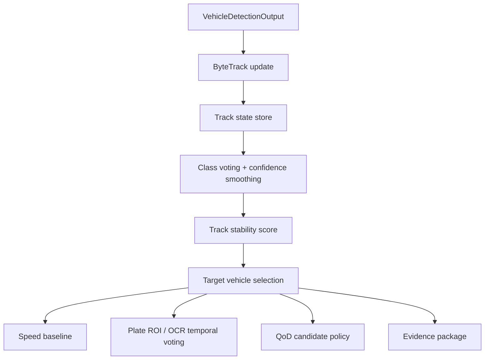

# Vehicle Tracking Deep Research Report

Tarih: 2026-06-10

Proje: Anomali Road Safety AI

## 1. Yönetici Özeti

Bu araştırmanın sonucu nettir:

* İlk baseline tracker: **ByteTrack**
* İkinci alternatif: **BoT-SORT**
* Üçüncü deney adayı: **OC-SORT**
* Şimdilik ertelenecekler: **DeepSORT**, **StrongSORT**, ağır ReID tabanlı kurulumlar
* Basit fallback: **Kalman + IoU matching** veya **Norfair**

Gerekçe:

Anomali Road Safety AI için tracking modülünün ilk görevi, en yüksek akademik MOT skorunu kovalamak değildir. İlk görev, pretrained vehicle detector çıktılarındaki araçları frame'ler arasında aynı fiziksel araca bağlamak, kısa false negative ve `car -> motorcycle` flicker davranışlarını yumuşatmak, speed estimation için trajectory üretmek, plate OCR için track-level temporal voting sağlamak ve evidence package içine denetlenebilir track geçmişi koymaktır.

Bu nedenle ilk aşamada ReID embedding kullanan karmaşık tracker yerine, detector çıktısını verimli kullanan tracking-by-detection yaklaşımı daha uygundur. ByteTrack özellikle düşük skorlu detection kutularını da association sürecinde kullandığı için kısa detection düşmelerine karşı pratik bir avantaj sağlar. BoT-SORT daha güçlü bir ikinci alternatiftir; camera motion compensation ve ReID seçenekleri sunar, fakat sabit yol kenarı kamerası ve MacBook local runtime bağlamında ilk aşamada gereksiz karmaşıklık/latency oluşturabilir.

## 2. Bu Projede Tracking'in Rolü

Tracking, detection sonrası çalışan bir süreklilik katmanıdır. Tek başına alarm üretmez. Görevi, her frame'de bulunan araç kutularını zamansal olarak aynı `track_id` altında birleştirmektir.

Bu projede tracking şu modüllerin temel girdisidir:

* **Speed estimation:** Araç merkezinin zamana göre yer değiştirmesi, pixel speed ve varsa homography tabanlı hız tahmini.
* **Plate OCR:** Aynı araca ait birden çok plate crop üzerinden temporal voting.
* **Risk decision:** Ani yanal hareket, hızlı yaklaşma, track stabilitesi, kaybolma/yeniden yakalanma sinyalleri.
* **QoD trigger:** Belirsiz ama önemli bir track varsa, daha iyi evidence kalitesi için QoD adaylığı.
* **Evidence package:** Event'in hangi frame aralığında, hangi track üzerinde, hangi bbox geçmişiyle oluştuğunun denetlenebilir kaydı.

Tracking modülü şu iddialardan kaçınmalıdır:

* Hukuki kusur kararı vermez.
* Kalibrasyon olmadan kesin km/s üretmez.
* Tek frame detection hatasını kesin olay olarak yorumlamaz.

## 3. Detector Çıktısından Alınacak Alanlar

Tracking input contract:

| Alan | Zorunlu mu? | Kullanım |
|---|---:|---|
| `frame_id` | Evet | Track history ve evidence bağlantısı |
| `timestamp_utc` | Evet | Hız / zaman penceresi |
| `bbox_xyxy` | Evet | IoU matching ve overlay |
| `bbox_xywh` | Evet | Kalman state, center displacement |
| `center_xy` | Evet | Trajectory ve speed |
| `class_name` | Evet | Track-level class voting |
| `class_id` | Evet | Model içi sınıf referansı |
| `confidence` | Evet | Association ve smoothing |
| `detection_quality_score` | Önerilir | Evidence crop seçimi |
| `condition_profile` | Önerilir | Düşük ışık / yağmur / sis yorumlama |
| `source_resolution` | Evet | Pixel coordinate consistency |
| `model_version` | Evet | Evidence audit |

## 4. Tracking Çıktıları

Tracking output contract:

| Alan | Açıklama |
|---|---|
| `track_id` | Aynı fiziksel araç için süreklilik kimliği |
| `track_status` | `new`, `active`, `lost`, `recovered`, `terminated` |
| `track_age_frames` | Track'in kaç frame sürdüğü |
| `hits` | Başarılı detection eşleşme sayısı |
| `misses` | Kısa süreli detection kaybı sayısı |
| `bbox_current` | Son bbox |
| `bbox_history` | Kısa pencere bbox geçmişi |
| `center_history` | Hız/motion için merkez geçmişi |
| `class_votes` | Track boyunca sınıf oyları |
| `stable_class` | Oylama/smoothing sonrası sınıf |
| `confidence_smoothed` | Track-level güven |
| `track_stability` | ID sürekliliği ve bbox kararlılığı skoru |
| `pixel_displacement` | Speed baseline için yer değiştirme |
| `best_frame_id` | Evidence için en iyi frame |
| `best_crop_ref` | Evidence için en iyi crop |
| `qod_candidate_signal` | QoD kararına katkı |

## 5. Tracker Adayları Karşılaştırması

| Tracker | Ana fikir | Artılar | Eksiler | Lisans notu | Proje kararı |
|---|---|---|---|---|---|
| ByteTrack | Düşük skorlu detection'ları da association'a dahil eder | Hızlı, basit, detector tabanlı, kısa false negative'e dayanıklı | ReID yok; uzun occlusion sonrası ID switch olabilir | MIT | İlk baseline |
| BoT-SORT | SORT/ByteTrack üzerine camera motion compensation ve ReID seçenekleri | Daha güçlü association, kalabalık/karmaşık sahnede iyi | ReID/GMC ayarı latency ve karmaşıklık ekleyebilir | MIT repo; Ultralytics kullanımı AGPL/Enterprise şartına bağlı | İkinci alternatif |
| OC-SORT | Observation-centric association | Hareket modelinin zayıfladığı durumlarda iyi aday | Entegrasyon Ultralytics kadar hazır değil | MIT | Üçüncü deney |
| DeepSORT | Kalman + Hungarian + ReID | Uzun occlusion ve identity için güçlü | ReID maliyeti, eski baseline, GPL lisans riski | GPL-3.0 official repo | Şimdilik ertelenir |
| StrongSORT | DeepSORT türevi güçlü ReID baseline | Akademik MOT skorları güçlü | Ağır, ReID bağımlılığı, pipeline karmaşıklığı | GPL-3.0 official repo | Şimdilik ertelenir |
| Norfair | Hafif, genel amaçlı Python tracker | Kolay entegrasyon, detector-agnostic | MOT benchmark standardı kadar yaygın değil | BSD-3-Clause | Basit fallback |
| Kalman + IoU | El yapımı baseline | Tam kontrol, düşük latency | ID switch ve false negative toleransı zayıf | Kendi kodumuz | Debug fallback |

## 6. ByteTrack vs BoT-SORT

### ByteTrack

ByteTrack'in temel değeri, yalnız yüksek confidence detection'ları değil, düşük confidence detection'ları da association sürecinde kullanmasıdır. Bu yaklaşım detector'ın düşük ışıkta kararsızlaştığı kısa anlarda track sürekliliğini korumaya yardımcı olabilir.

Bu projeye etkisi:

* Dark/low-light videolarda kısa detection düşmelerini daha iyi yönetebilir.
* `car -> motorcycle` gibi kısa sınıf flicker durumlarında class voting ile birlikte yeterli olabilir.
* ReID modeli çağırmadığı için MacBook runtime açısından daha düşük maliyetlidir.
* Ultralytics `track(..., tracker="bytetrack.yaml")` ile hızlı denenebilir.

Sınırları:

* Uzun süreli occlusion sonrası aynı aracı yeniden tanımada ReID kadar güçlü değildir.
* Kamera görüntüsünde araçlar sık sık birbirini kapatıyorsa ID switch üretebilir.

### BoT-SORT

BoT-SORT, tracking-by-detection hattını daha gelişmiş association, camera motion compensation ve ReID opsiyonlarıyla güçlendirir. Ultralytics tarafında default tracker olarak yer alması pratik entegrasyon sağlar.

Bu projeye etkisi:

* Araçlar birbirine yakın geçiyorsa ByteTrack'ten daha stabil olabilir.
* ReID açılırsa occlusion sonrası identity koruması artabilir.
* Sabit kamera için camera motion compensation şart değildir; kapalı veya düşük öncelikli denenebilir.

Sınırları:

* ReID açılırsa latency ve model bağımlılığı artar.
* İlk MVP'de sorunu çözmeden önce sistemi karmaşıklaştırabilir.

## 7. ReID Gerekli mi?

İlk aşamada **hayır**.

Gerekçe:

* Demo sabit yol kenarı kamerası.
* Asıl ihtiyaç, kısa frame penceresinde track continuity.
* Araç detection ve plate/evidence pipeline'ı henüz yeni kuruluyor.
* ReID embedding ekstra inference maliyeti ve model/lisans bağımlılığı getirir.
* MacBook local edge runtime'da p95 latency kritik.

ReID şu koşullarda tekrar değerlendirilir:

* ID switch sayısı risk/evidence kararını bozuyorsa.
* Araçlar sık sık birbirini kapatıyorsa.
* Aynı event içinde hedef araç kaybolup yeniden geliyorsa.
* Plate/OCR temporal voting yanlış track'e bağlanıyorsa.

Bu durumda önce BoT-SORT ReID opsiyonları, sonra DeepSORT/StrongSORT araştırılır.

## 8. Sabit Kamera + Yol Kenarı Demo İçin Seçim

Önerilen seçim:

1. **ByteTrack** ile başla.
2. Aynı videolarda **BoT-SORT** ile karşılaştır.
3. Sorun devam ederse **OC-SORT** ekle.

Sabit kamera senaryosunda kamera hareketi düşük olduğu için BoT-SORT'un camera motion compensation avantajı sınırlı kalabilir. Buna karşılık ByteTrack'in düşük confidence detection'ları association'a dahil etmesi, düşük ışık ve kısa false negative problemlerine daha doğrudan temas eder.

## 9. MacBook Runtime Değerlendirmesi

Tracking maliyeti detector maliyetinden düşük olmalıdır. Bu yüzden ölçümde iki ayrı latency tutulmalıdır:

* detector inference latency,
* tracker update latency.

İlk hedef:

* tracker update p95 latency: düşük tek haneli ms veya detector latency yanında ihmal edilebilir seviye,
* pipeline p95 latency: live overlay için yönetilebilir,
* track ID üretimi: her frame veya detection frekansında.

BoT-SORT ReID kapalı denenebilir. ReID açık mod ancak benchmark latency ve ID stability ihtiyacı bunu haklı çıkarırsa denenmelidir.

## 10. Detection Hatalarına Karşı Tracking Stratejisi

Mevcut gözlem:

* Araç genel olarak yakalanıyor.
* Bazı false negative'ler var.
* 2-3 frame seviyesinde `car -> motorcycle` gibi class flicker görülebiliyor.

Önerilen strateji:

1. Detector confidence threshold'u tek başına yükseltme; düşük ışıkta recall düşebilir.
2. ByteTrack ile düşük confidence detection association'ı dene.
3. Track-level class voting kullan.
4. Class değişimini tek frame'de kabul etme.
5. `stable_class` için sliding window veya exponential smoothing kullan.
6. `track_stability` düşükse speed/plate/risk uzmanlarını çağırma veya düşük güvenle çağır.
7. Evidence için tek frame değil, track boyunca en iyi crop seç.

## 11. Track-Level Class Voting ve Smoothing

Basit başlangıç:

* Son 15-30 frame için sınıf oyları tutulur.
* Confidence ile ağırlıklandırılmış oy kullanılır.
* `stable_class` en yüksek toplam oya sahip sınıf olur.
* Track yaşı 5 frame altındaysa class kararı `unstable` kalabilir.
* Ani class değişimi en az 3-5 ardışık frame desteklenmedikçe kabul edilmez.

Örnek:

```json
{
  "track_id": "TRK-17",
  "raw_class_latest": "motorcycle",
  "stable_class": "car",
  "class_votes": {
    "car": 13.8,
    "motorcycle": 1.7
  },
  "class_switch_suppressed": true
}
```

## 12. Speed Estimation Bağlantısı

Tracking speed estimation için şu alanları üretmelidir:

* center history,
* timestamp history,
* pixel displacement,
* bbox scale change,
* track age,
* missing frame count.

İlk baseline:

* `relative_speed_class`: `slow`, `normal`, `fast`, `suspicious`
* `pixel_speed_px_per_sec`
* `motion_anomaly_score`

Kalibrasyon yoksa `estimated_kmh` üretilmemeli veya `not_calibrated` olarak işaretlenmelidir. Homography ve referans mesafe final scope'ta ele alınır.

## 13. Plate OCR Bağlantısı

Tracking plate OCR için iki avantaj sağlar:

1. Aynı araca ait plate crop'ları aynı `track_id` altında birikir.
2. OCR sonucu tek frame yerine temporal voting ile stabilize edilir.

Plate pipeline tetik koşulu:

* `track_age_frames >= N`
* `track_stability >= threshold`
* bbox yeterince büyük
* target vehicle selected
* plate visibility/görüntü kalitesi yeterli

Evidence için en iyi crop seçimi:

* yüksek detection confidence,
* düşük blur,
* yüksek brightness/contrast,
* büyük bbox,
* plate OCR confidence.

## 14. QoD ve Evidence Bağlantısı

Tracking QoD kararına şu sinyalleri verir:

* target track stable ama evidence crop kalitesi düşük,
* risk score yükseliyor ama detection confidence dalgalı,
* plate/OCR için daha net frame gerekiyor,
* track kaybolma riski var,
* low-light/poor visibility altında önemli event penceresi oluşuyor.

Evidence package içine yazılması gereken track alanları:

* `track_id`
* `tracker_version`
* `track_start_frame`
* `track_end_frame`
* `track_age_frames`
* `bbox_history_sample`
* `center_history_sample`
* `stable_class`
* `class_votes`
* `track_stability`
* `id_switch_suspected`
* `best_frame_id`
* `best_crop_ref`
* `tracking_latency_ms`

## 15. Tracking Metrikleri

Ground truth olan benchmarklarda:

* IDF1
* HOTA
* MOTA
* MOTP
* ID switches
* track fragmentation
* mostly tracked
* mostly lost
* false positives
* false negatives
* runtime FPS
* p95 latency

Bu projede öncelik sırası:

1. ID continuity
2. ID switch azlığı
3. track fragmentation azlığı
4. target track stability
5. speed/plate/evidence kullanılabilirliği
6. runtime latency

MOTA tek başına yeterli değildir; detection false positive/false negative etkisiyle karışır. IDF1 ve HOTA tracking kalitesini daha iyi yansıtır.

## 16. Ground Truth Olmayan 3 Dark Video İçin Manual Review

Mevcut `Test/video_1-3.mp4` dosyaları tracking eğitim verisi değildir. İlk smoke test ve manual review materyalidir.

Manual review yöntemi:

1. Her videoda 3-5 görünür hedef araç seç.
2. Her hedef için göründüğü frame aralığını not et.
3. Track ID'nin aynı kalıp kalmadığını kontrol et.
4. Kısa detection kaybından sonra aynı track'in devam edip etmediğini not et.
5. Class flicker'ın `stable_class` çıktısına yansıyıp yansımadığını kontrol et.
6. Speed için center trail'in mantıklı olup olmadığını kontrol et.
7. Plate/evidence için best crop seçiminin kullanılabilir olup olmadığını not et.

Manual skor önerisi:

* `track_continuity_score`: 0-1
* `id_switch_count`
* `fragmentation_count`
* `class_stability_score`
* `speed_signal_usable`: yes/no
* `plate_temporal_voting_usable`: yes/no
* `evidence_track_usable`: yes/no

## 17. Public Datasetler

| Dataset | Kullanım | Not |
|---|---|---|
| BDD100K MOT | Road-domain multi-object tracking | Weather/time/scene bağlamıyla proje için en uyumlu aday |
| UA-DETRAC | Vehicle detection/tracking | Trafik gözetim kamerası bağlamı için uygun |
| KITTI Tracking | Araç/yaya tracking benchmark | Otonom sürüş araştırmasında yaygın |
| MOTChallenge | Genel MOT metrik ve benchmark standardı | İnsan odaklı olsa da metrik/araç altyapısı değerli |
| AI City Challenge | Trafik/şehir video analitiği | Vehicle tracking ve city-scale görevler için araştırma kaynağı |

İlk etapta bu datasetlerle eğitim yapılmayacak. Benchmark ve literatür dayanağı olarak kullanılacak. Fine-tune veya test split kullanımı lisans doğrulaması sonrası açılmalıdır.

## 18. Lisans Değerlendirmesi

| Bileşen | Lisans notu | Etki |
|---|---|---|
| ByteTrack official repo | MIT | İlk baseline için uygun |
| BoT-SORT official repo | MIT | İkinci alternatif için uygun |
| OC-SORT official repo | MIT | Deney adayı için uygun |
| DeepSORT official repo | GPL-3.0 | Repo/ürün lisans stratejisi açısından riskli |
| StrongSORT official repo | GPL-3.0 | Repo/ürün lisans stratejisi açısından riskli |
| Norfair | BSD-3-Clause | Hafif fallback için uygun |
| Ultralytics track mode | Ultralytics AGPL/Enterprise koşullarına bağlı | Mevcut YOLO kullanımıyla birlikte lisans değerlendirmesi gerekir |

Not:

Repo private olsa bile lisans yükümlülükleri ortadan kalkmaz. Final ürün/dağıtım/servis kapsamı netleştiğinde AGPL/Enterprise/MIT/GPL etkileri ayrıca karar dosyasına bağlanmalıdır.

## 19. İlk MVP Tracking Mimarisi

Önerilen MVP:



State store alanları:

* active tracks,
* lost tracks,
* history window,
* track lifecycle,
* class votes,
* best frame candidate,
* latency stats.

## 20. Benchmark Planı

İlk benchmark deneyleri:

| Deney | Tracker | Detector | Veri | Amaç |
|---|---|---|---|---|
| TRK-EXP-001 | ByteTrack | selected pretrained detector | Test/video_1-3 | İlk baseline |
| TRK-EXP-002 | BoT-SORT ReID off | selected pretrained detector | Test/video_1-3 | İkinci alternatif |
| TRK-EXP-003 | BoT-SORT ReID on | selected pretrained detector | Test/video_1-3 | Yalnız latency uygunsa |
| TRK-EXP-004 | OC-SORT | selected pretrained detector | Test/video_1-3 | Sorun devam ederse |
| TRK-EXP-005 | Kalman + IoU | selected pretrained detector | Test/video_1-3 | Debug fallback |

Makine ölçümü:

* processed frames,
* active track count,
* new/lost/recovered tracks,
* mean tracker latency,
* p95 tracker latency,
* pipeline FPS,
* average track age,
* track fragmentation proxy.

Manual ölçüm:

* selected target count,
* ID switch count,
* fragmentation count,
* class flicker suppressed,
* speed trail usable,
* plate/evidence crop usable.

## 21. Önerilen İlk Uygulama Planı

1. Seçilen vehicle detector çıktısını frame bazlı JSON'a bağla.
2. Ultralytics `model.track(..., tracker="bytetrack.yaml", persist=True)` ile ilk smoke test yap.
3. Track output'u `TrackingOutput` contract'ına dönüştür.
4. Track state store ekle.
5. Track-level class voting ve confidence smoothing ekle.
6. `track_stability` metriğini üret.
7. Manual review CSV'sini doldur.
8. Aynı akışı `botsort.yaml` ile tekrar çalıştır.
9. ByteTrack vs BoT-SORT kararını latency + manual ID stability ile ver.
10. Target vehicle selection ve first event/evidence JSON'a geç.

## 22. Riskler ve Fallback Stratejileri

| Risk | Etki | Fallback |
|---|---|---|
| Detector false negative | Track fragmentation | ByteTrack low-score association, `max_age` tuning |
| Class flicker | Yanlış risk/plate routing | Track-level class voting |
| ID switch | Evidence yanlış araca bağlanabilir | Manual review, BoT-SORT denemesi, ReID sadece gerekirse |
| Low-light bbox jitter | Speed sinyali bozulur | Smoothing, minimum track age, speed confidence |
| High latency | Live demo akışı yavaşlar | ReID kapalı, ByteTrack, frame skip |
| Lisans riski | Repo/ürün uyumu bozulur | MIT/BSD adayları öncele, GPL adayları ertele |
| Ground truth yokluğu | Metrik kesinliği düşük | Manual review + küçük labelled subset |

## 23. Net Karar

### İlk baseline tracker

**ByteTrack**

Neden:

* Eğitim gerektirmez.
* Detector çıktısına doğrudan bağlanır.
* Low-confidence detection association yaklaşımı düşük ışık ve kısa false negative problemlerine uygundur.
* MacBook runtime için düşük karmaşıklık sağlar.
* MIT lisanslı resmi repo ve Ultralytics track mode entegrasyonu vardır.

### İkinci alternatif

**BoT-SORT, başlangıçta ReID kapalı**

Neden:

* Ultralytics içinde default tracker olarak kolay denenebilir.
* ByteTrack ID stability yetersiz kalırsa daha güçlü association sağlar.
* ReID yalnız ihtiyaç kanıtlanırsa açılmalıdır.

### Şimdilik ertelenecekler

* DeepSORT: ReID maliyeti ve GPL-3.0 lisans riski.
* StrongSORT: ReID/akademik kurulum karmaşıklığı ve GPL-3.0 lisans riski.
* OC-SORT: iyi aday ama ilk entegrasyon kolaylığı ByteTrack/BoT-SORT kadar yüksek değil; üçüncü deney olarak tutulmalı.

## 24. Kaynakça

* ByteTrack paper: https://arxiv.org/abs/2110.06864
* ByteTrack official repository: https://github.com/FoundationVision/ByteTrack
* ByteTrack license: https://raw.githubusercontent.com/FoundationVision/ByteTrack/main/LICENSE
* BoT-SORT paper: https://arxiv.org/abs/2206.14651
* BoT-SORT official repository: https://github.com/NirAharon/BoT-SORT
* BoT-SORT license: https://raw.githubusercontent.com/NirAharon/BoT-SORT/main/LICENSE
* DeepSORT official repository: https://github.com/nwojke/deep_sort
* DeepSORT license: https://raw.githubusercontent.com/nwojke/deep_sort/master/LICENSE
* OC-SORT paper: https://arxiv.org/abs/2203.14360
* OC-SORT official repository: https://github.com/noahcao/OC_SORT
* StrongSORT repository: https://github.com/dyhBUPT/StrongSORT
* Norfair repository: https://github.com/tryolabs/norfair
* Norfair license: https://raw.githubusercontent.com/tryolabs/norfair/master/LICENSE
* Ultralytics tracking docs: https://docs.ultralytics.com/modes/track/
* Ultralytics tracker docs source: https://github.com/ultralytics/ultralytics/blob/main/docs/en/modes/track.md
* Ultralytics license: https://www.ultralytics.com/license
* TrackEval repository: https://github.com/JonathonLuiten/TrackEval
* HOTA metrics paper: https://arxiv.org/abs/2009.07736
* MOTChallenge evaluation: https://motchallenge.net/
* BDD100K official site: https://bdd-data.berkeley.edu/
* BDD100K paper/site: https://bair.berkeley.edu/blog/2018/05/30/bdd/
* UA-DETRAC dataset: https://detrac-db.rit.albany.edu/
* KITTI Tracking benchmark: https://www.cvlibs.net/datasets/kitti/eval_tracking.php
* AI City Challenge: https://www.aicitychallenge.org/
