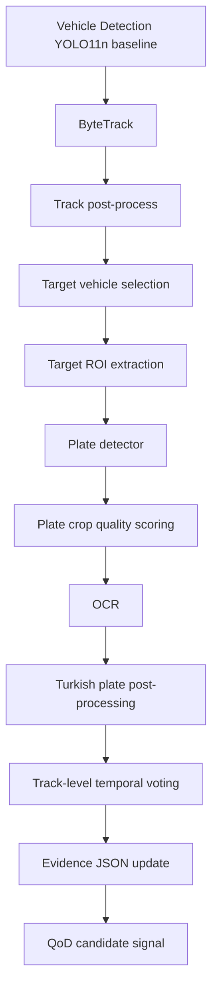

# Deep Research Report - License Plate Detection + Plate OCR

Tarih: 2026-06-11

## 1. Yönetici Özeti

Bu proje için ilk uygulanabilir plate/OCR baseline, **iki aşamalı ve track-aware** bir mimari olmalıdır:

1. ByteTrack sonrası seçilen `target_track_id` üzerinden hedef araç ROI çıkarılır.
2. Plate detector yalnız bu ROI içinde çalışır.
3. En iyi plate crop adayları kalite skoruyla seçilir.
4. OCR seçilmiş crop pencerelerinde çalışır.
5. Türk plaka formatı regex + il kodu kontrolü + karakter normalizasyonu ile doğrulanır.
6. Tek frame OCR sonucu yerine track-level temporal voting yapılır.
7. Event/evidence JSON içine raw adaylar, final vote, confidence, failure reason ve privacy metadata yazılır.

İlk baseline kararı:

* Plate detector: **Roboflow/CC BY 4.0 kaynaklı license plate detector ailesinden indirilebilir YOLO/ONNX baseline veya HF YOLOS-small detector ile smoke test**.
* OCR: **PaddleOCR PP-OCRv5 Latin/mobile recognition ilk aday**, **EasyOCR ikinci aday**, **Tesseract debug/fallback aday**.
* Fine-tune: İlk MVP'de yapılmamalı. Önce target ROI -> plate detection -> OCR -> temporal voting -> evidence contract çalışır hale getirilmeli.
* End-to-end ALPR: İlk aşamada ertelenmeli. Debug/evidence/fallback açısından iki aşamalı pipeline daha savunulabilir.

Bu kararın varsayımı: canlı demo MacBook local edge/backend üzerinde çalışacak, test videoları dark/low-light olacak, sistem hukuki karar değil karar destek/evidence hazırlama sistemi olarak konumlanacak.

## 2. Bu Projede Plate Detection + OCR'ın Rolü

Plate/OCR modülü sistemde üç iş yapar:

* Hedef araç track'ini denetlenebilir kimlik adayına bağlar.
* Evidence package içine plaka crop, OCR sonucu ve güven/kalite bilgisi ekler.
* QoD/risk routing için "kanıt kalitesi artabilir mi?" sinyali üretir.

Modül **tüm frame üzerinde sürekli çalışmamalıdır**. Normal modda tüm araçlar tespit/takip edilir; plate/OCR ise yalnız:

* `track_stability >= 0.50` olan target track'lerde,
* seçilmiş frame/crop penceresinde,
* risk/evidence ihtiyacı oluştuğunda,
* QoD aktif olduğunda yeniden değerlendirme gerektiğinde

çalışmalıdır.

Bu yaklaşım MacBook runtime yükünü düşürür ve yanlış araç/plaka eşleşmesi riskini azaltır.

## 3. Önerilen İlk MVP Mimarisi



Başlangıç uygulama kuralı:

* Plate detector: target vehicle ROI içinde çalışır.
* OCR: her frame'de değil; track boyunca seçilen en iyi 5-10 crop adayında çalışır.
* Voting: full-string voting + character-level voting birlikte tutulur.
* Final değer düşük güvenliyse `ocr_status=low_confidence` veya `not_read` döner; plaka metni zorla kesinleştirilmez.

## 4. Plate Detection Adayları Karşılaştırma Tablosu

| Aday | Güçlü taraf | Zayıf taraf | Lisans / risk | İlk MVP kararı |
|---|---|---|---|---|
| YOLO11/YOLOv8 plate detector | Hızlı, bbox kalitesi iyi, Ultralytics pipeline ile uyumlu | Ultralytics kod/model lisansı AGPL-3.0/Enterprise; public model kartları çoğunlukla AGPL | Ultralytics resmi lisans sayfası AGPL-3.0 + Enterprise ayrımı yapıyor | Kullanılabilir ama lisans notu şart |
| Roboflow Universe LPR detector | Hazır dataset/model, yüksek reported mAP sürümleri | Roboflow API bağımlılığı veya model export/lisans kontrolü gerekir; reported metrik domain dışı olabilir | Roboflow dataset sürümleri CC BY 4.0 olarak listeleniyor | İyi ilk detector kaynağı |
| HF `morsetechlab/yolov11-license-plate-detection` | İndirilebilir, popüler HF model, ONNX etiketi var | AGPL-3.0 etiketli, ülke/domain genellemesi belirsiz | HF model card AGPL-3.0 etiketi taşıyor | Smoke test yapılabilir, final lisans dikkat |
| HF `nickmuchi/yolos-small-finetuned-license-plate-detection` | Transformers tabanlı, Ultralytics'e bağımlı değil | YOLOS latency YOLO kadar pratik olmayabilir; model eski | Model card Roboflow LPR dataset ile fine-tune edildiğini söylüyor | Lisans uygunsa ikinci detector adayı |
| PaddleOCR text detector | OCR ekosistemiyle bütünleşik | Genel text detector, plaka localization için fazla genel olabilir | PaddleOCR Apache-2.0 | Plate detector yerine OCR pipeline fallback |
| OpenALPR | ALPR için tasarlanmış uçtan uca sistem | AGPL/commercial lisans, eski/operasyonel entegrasyon riski | OpenALPR repo AGPL-3.0, commercial lisans ayrı | Şimdilik ertelenmeli |
| WPOD-NET / LPRNet tabanlı detector | ALPR literatüründe plate odaklı | Çoğu repo eski, ülke/format bağımlı, maintenance belirsiz | Repo bazlı değişir | Araştırma/fine-tune fazına ertelenmeli |
| Basit OCR-only ROI denemesi | En hızlı debug | Plaka localization yoksa OCR gürültülü çalışır | OCR motoruna bağlı | Sadece fallback/debug |

## 5. OCR Adayları Karşılaştırma Tablosu

| Aday | Güçlü taraf | Zayıf taraf | Lisans / risk | İlk MVP kararı |
|---|---|---|---|---|
| PaddleOCR PP-OCRv5 Latin/mobile | Aktif geliştirme, multilingual/Latin support, lightweight rec modeller, Apache-2.0 | Paddle runtime kurulumu EasyOCR'dan daha karmaşık olabilir; Mac MPS doğrudan avantaj sağlamayabilir | Apache-2.0 | İlk OCR baseline |
| EasyOCR | Kurulumu pratik, PyTorch tabanlı, Türkçe/Latin desteği, Apache-2.0 | Plate-specific değil; küçük/blur plakalarda hata yapabilir | Apache-2.0 | İkinci OCR baseline |
| Tesseract | Çok hafif, CLI/API, Apache-2.0 | Low-light/blur/crop kalitesi kötü olduğunda zayıf; modern OCR kadar dayanıklı değil | Apache-2.0 | Debug/fallback |
| LPRNet | Plate-specific, lightweight | Ülke formatına göre eğitim/fine-tune ihtiyacı yüksek | Bazı popüler repo Apache-2.0 | Fine-tune sonrası aday |
| CRNN | Plate OCR için yaygın, CTC ile uygun | Pretrained TR/european model bulmak zor olabilir | Repo/model bazlı | Fine-tune sonrası aday |
| TrOCR / PARSeq / ViT OCR | Güçlü sequence recognition | MacBook latency ve küçük crop/domain uyumu belirsiz; fine-tune gerekebilir | Model bazlı | Ertelenmeli |
| End-to-end ALPR modelleri | Tek inference zinciri olabilir | Debug ve evidence ayrıştırması zayıf; ülke formatı adaptasyonu zor | Model bazlı | İlk MVP'de ertelenmeli |

## 6. İki Aşamalı Pipeline vs End-to-End ALPR Analizi

İki aşamalı pipeline bu proje için daha doğru:

* Evidence package içinde `vehicle_bbox`, `plate_bbox`, `plate_crop_uri`, `ocr_text_raw`, `ocr_text_normalized`, `failure_reason` ayrı ayrı saklanabilir.
* Hata kaynağı ayrıştırılır: "plaka bulunamadı" ile "plaka bulundu ama OCR okunamadı" farklı durumlar olarak gösterilir.
* QoD kararı daha açıklanabilir olur: track stabil ama plate crop düşük kaliteliyse QoD adaylığı üretilebilir.
* Türk plaka regex, il kodu kontrolü ve temporal voting bağımsız modül olarak eklenebilir.
* Fine-tune fazında yalnız detector veya yalnız OCR iyileştirilebilir.

End-to-end ALPR ilk MVP için ertelenmeli. Özellikle dark/low-light ve Türkiye formatı için domain adaptation ihtimali yüksektir. Ayrıca event/evidence contract içinde modül bazlı açıklanabilirlik iki aşamalı yapıda daha güçlüdür.

## 7. Türk Plaka Post-Processing Stratejisi

Başlangıç normalizasyonu:

* Büyük harfe çevir.
* Boşluk, tire, nokta, özel karakterleri temizle.
* Türkçe karakterleri bekleme; standart plaka Latin harf bloklarıyla ele alınır.
* Başta iki haneli il kodu bekle.
* İl kodu `01`-`81` aralığında olmalı.

Başlangıç regex:

```regex
^(0[1-9]|[1-7][0-9]|8[01])([A-Z]{1}\d{4,5}|[A-Z]{2}\d{3,4}|[A-Z]{3}\d{2,4})$
```

Raporlama için daha okunur format:

* `34ABC123` -> `34 ABC 123`
* `06A1234` -> `06 A 1234`

Karakter karışıklıkları kural tabanlı ama konuma duyarlı olmalı:

* Rakam beklenen yerde: `O -> 0`, `I -> 1`, `S -> 5`, `Z -> 2`, `G -> 6`, `B -> 8`
* Harf beklenen yerde: `0 -> O`, `1 -> I` veya `I/L` aday, `5 -> S`, `2 -> Z`, `6 -> G`, `8 -> B`

Düşük güven durumunda tek bir "düzeltilmiş kesin plaka" yazılmamalı. Event içinde:

* `ocr_text_raw`
* `ocr_text_normalized`
* `format_valid`
* `province_code_valid`
* `normalization_applied`
* `low_confidence_chars`

ayrı tutulmalıdır.

## 8. Track-Level Temporal Voting Tasarımı

OCR her frame'de çalıştırılmamalı. Önerilen MVP:

* Her target track için en fazla 10 frame/crop seç.
* Crop seçimi şu skora göre yapılsın:
  * plate confidence,
  * crop area,
  * blur score,
  * contrast score,
  * bbox merkeziliği,
  * track stability.
* OCR sonuçları iki seviyede saklansın:
  * Full-string candidate voting.
  * Character-position voting.
* Format-valid sonuçlara 1.25-1.5 arası ağırlık verilebilir.
* OCR confidence düşükse veya string uzunluğu formatla uyuşmuyorsa aday tutulur ama final vote'a düşük ağırlık verilir.
* Çelişkili sonuçlarda `ocr_status=low_confidence` dönülür; en yüksek aday `temporal_vote_text` olarak işaretlenir ama `final_plate_asserted=false` tutulur.

Minimal voting skoru:

```text
candidate_score =
  0.45 * ocr_confidence +
  0.20 * plate_confidence +
  0.15 * plate_quality_score +
  0.10 * format_valid_bonus +
  0.10 * track_stability
```

## 9. Low-Light / Dark Video Stratejisi

Dark videolarda temel riskler:

* Plaka küçük ve uzak olabilir.
* Far/parlama plaka bölgesini patlatabilir.
* Motion blur OCR karakterlerini bozabilir.
* Araç bbox doğru olsa bile plate bbox görünmeyebilir.

İlk MVP'de ağır super-resolution yerine hafif crop enhancement denenmeli:

* CLAHE / contrast enhancement,
* grayscale normalization,
* sharpening,
* denoise,
* optional upscale 2x.

Bu işlemler her frame'e değil yalnız seçilmiş plate crop adaylarına uygulanmalı. QoD aktif olduğunda daha yüksek bitrate/resolution, özellikle küçük/uzak plaka crop'larında fayda sağlayabilir; ama bu iddia testle doğrulanmalıdır.

## 10. QoD Bağlantısı

QoD her OCR başarısızlığında açılmamalıdır.

QoD adaylığı için önerilen koşullar:

* `track_stability >= 0.75`
* Hedef araç görünürlüğü iyi fakat plate crop düşük kaliteli.
* `plate_detected=true` ama `ocr_status=low_confidence`.
* `plate_quality_score` düşük ve crop alanı küçük.
* `format_valid=false` ama temporal vote adayları birbirine yakın.
* Evidence değerinin artacağı açıkça gösterilebiliyor.

QoD adaylığı üretilmemeli:

* Target track kararsızsa.
* Plaka fiziksel olarak görünmüyorsa.
* Araç çok uzakta ve crop bilgi taşımıyorsa.
* QoD aktif olsa bile frame kalitesi artışının fayda sağlamayacağı düşünülüyorsa.

## 11. Evidence Package Bağlantısı

Plate/OCR sonrası event içine zorunlu yazılması gereken alanlar:

* `track_id`
* `frame_id`
* `vehicle_bbox`
* `plate_bbox`
* `vehicle_crop_uri`
* `plate_crop_uri`
* `overlay_image_uri`
* `ocr_text_raw`
* `ocr_text_normalized`
* `ocr_confidence`
* `format_valid`
* `province_code_valid`
* `temporal_vote_candidates`
* `model_versions`
* `processing_latency_ms`
* `failure_reason`
* `privacy_note`
* `retention_policy_tag`

Privacy önerisi:

* Geliştirme artifactlerinde plaka metni düz tutulmamalı veya sadece izole/local ortamda tutulmalı.
* Rapor/demo ekranında maskeleme opsiyonu bulunmalı: `34 ABC 123` -> `34 A** **3`.
* Evidence JSON içinde gerekirse `plate_text_hash` tutulabilir.
* Plaka metni kişisel veri gibi ele alınmalı; minimum saklama ve erişim kontrolü dokümante edilmeli.

## 12. Benchmark ve Metrik Planı

Plate detection:

* precision,
* recall,
* mAP@0.5,
* mAP@0.5:0.95,
* IoU,
* false positive plate,
* missed plate,
* p95 latency,
* target ROI başına runtime.

OCR:

* character accuracy,
* full plate accuracy,
* edit distance,
* format-valid accuracy,
* province-code validity,
* low-confidence rejection accuracy.

Track-level ALPR:

* per-frame OCR accuracy,
* per-track final OCR accuracy,
* time-to-first-readable-plate,
* best-frame OCR accuracy,
* temporal voting gain,
* evidence completeness score.

Ground truth yoksa bu metrikler final accuracy olarak değil `manual qualitative review`, `smoke test`, `pipeline usability` olarak raporlanmalıdır.

## 13. Manual Review Şablonu

Önerilen CSV:

```csv
video,event_id,track_id,best_frame,plate_visible_manual,plate_detected_model,plate_bbox_correct_manual,ocr_text_model,ocr_readable_manual,ocr_correct_manual,partial_match_manual,failure_reason,needs_qod_manual,reviewer_note
```

Kullanılacak ifadeler:

* `manual qualitative review`
* `smoke test`
* `pipeline usability`
* `not final OCR accuracy`

## 14. Dataset ve Lisans İncelemesi

| Dataset | Bölge/format | İçerik | Lisans/erişim | MVP kullanımı |
|---|---|---|---|---|
| CCPD | Çin | Büyük ölçekli plate detection/recognition; blur/rotate/tilt/challenge alt setleri | GitHub üzerinden indirilebilir; lisans ayrıca doğrulanmalı | Benchmark/fine-tune için faydalı ama TR formatına uzak |
| UFPR-ALPR | Brezilya | 4,500 fully annotated image, 150 vehicle, moving camera/vehicle | Resmi sayfa akademik kullanım vurgular; request gerekebilir | Gerçekçi video tabanlı ALPR benchmark için güçlü |
| AOLP | Tayvan | 2,049 image; access control, enforcement, road patrol | GitHub/OpenDataLab; lisans doğrulanmalı | Küçük benchmark |
| SSIG-SegPlate | Brezilya | ALPR literatüründe sık kullanılan video/frame dataset | Akademik kaynaklarda geçiyor; erişim/lisans doğrulanmalı | Temporal redundancy araştırması için yararlı |
| Roboflow LPR / keremberke | Çeşitli | 8,823-10,125 license plate detection image; COCO bbox | HF dataset card CC BY 4.0; Roboflow sürümleri CC BY 4.0 olarak listeleniyor | İlk plate detector baseline/fine-tune adayı |
| HF license plate text datasets | Çeşitli | image-to-text plate OCR subsetleri | Dataset card bazlı; bazıları CC BY 4.0/MIT | OCR smoke test adayı |
| Türk plaka datasetleri | Türkiye | Arama gerekli | Lisans/etik risk yüksek olabilir | Final öncesi ayrıca doğrulanmalı |

## 15. MacBook Local Runtime Değerlendirmesi

| Pipeline | Runtime beklentisi | Uygunluk |
|---|---|---|
| YOLO plate detector + PaddleOCR | Detector hızlı; OCR crop sayısı sınırlanırsa makul | En iyi ilk MVP dengesi |
| YOLO plate detector + EasyOCR | Kurulum kolay; PyTorch tabanlı | İyi ikinci baseline |
| YOLO plate detector + Tesseract | Hafif ve debug dostu | OCR kalitesi düşük kalabilir |
| PaddleOCR full pipeline | Tek OCR ekosistemi | Plate localization için fazla genel olabilir |
| LPRNet | Hafif ve plate-specific | TR formatı için fine-tune gerekebilir |
| End-to-end ALPR | Potansiyel hızlı | Evidence/debug/fallback açısından erken |

MacBook için önemli kural: OCR tüm frame'e değil, target ROI'den çıkarılan az sayıda crop'a uygulanmalıdır.

## 16. İlk Uygulama Planı

1. `research/04_plate_ocr` altında plate/OCR decision ve benchmark planı tamamlanır.
2. Target event skeleton içindeki `best_frame` ve `best_bbox_xyxy` ile raw videodan target ROI crop çıkarılır.
3. Plate detector baseline target ROI üstünde çalıştırılır.
4. Plate bbox source frame koordinatına geri map edilir.
5. Plate crop quality hesaplanır.
6. PaddleOCR/EasyOCR OCR çalıştırılır.
7. Türk plaka regex + il kodu + karakter normalizasyonu uygulanır.
8. Track-level temporal voting yapılır.
9. Event/evidence JSON plate alanlarıyla güncellenir.
10. Manual review CSV doldurulur.

Pseudo-code:

```python
for event in target_vehicle_events:
    frames = select_candidate_frames(event.track_id, event.bbox_history_sample)
    plate_candidates = []
    for frame in frames:
        roi = crop_vehicle_roi(frame, event.target_bbox)
        plates = plate_detector(roi)
        for plate in plates:
            crop = crop_plate(roi, plate.bbox)
            quality = score_plate_crop(crop)
            if quality >= min_quality:
                text = ocr(crop)
                normalized = normalize_turkish_plate(text.raw)
                plate_candidates.append({
                    "frame_id": frame.id,
                    "plate_bbox": plate.bbox_source,
                    "ocr_raw": text.raw,
                    "ocr_normalized": normalized.text,
                    "format_valid": normalized.format_valid,
                    "score": vote_score(text, plate, quality, event.track_stability),
                })
    final = temporal_vote(plate_candidates)
    update_evidence(event, final, plate_candidates)
```

## 17. Fine-Tune Ne Zaman Açılmalı?

Fine-tune ilk MVP'de açılmamalı. Şu koşullardan biri kanıtlanırsa açılmalı:

* Plate detection recall düşükse.
* Low-light target ROI içinde plaka sürekli kaçıyorsa.
* Public detector Türkiye/Avrupa plaka formuna zayıf kalıyorsa.
* OCR format-valid ama karakter hataları sistematikse.
* Temporal voting OCR hatasını yeterince düzeltmiyorsa.

Fine-tune sırası:

1. Önce plate detector fine-tune.
2. Sonra OCR fine-tune veya LPRNet/CRNN plate-specific model.
3. Gerekirse sentetik Türk plaka üretimi + low-light augmentation.

## 18. Riskler ve Fallback Stratejileri

| Durum | Sistem çıktısı |
|---|---|
| Plate not detected | `plate.status=not_detected`, `ocr_status=not_run`, QoD adaylığı yalnız track stabil ve crop bilgi taşıyorsa |
| Plate detected but OCR failed | `plate.status=detected`, `ocr_status=not_read`, crop evidence saklanır |
| OCR low confidence | `ocr_status=low_confidence`, final text kesinleştirilmez |
| Format invalid | `format_valid=false`, raw text saklanır, normalized text aday kalır |
| Plate crop blurred | `plate.status=blurred`, `failure_reason=plate_crop_blur_high` |
| Target track unstable | Plate/OCR ertelenir veya düşük güvenle çalışır |
| Multiple plates in ROI | En yüksek plate quality + bbox prior seçilir; diğerleri candidate olarak saklanır |
| Wrong target selected | Manual review flag; target selector yeniden ayarlanır |
| Low-light evidence insufficient | QoD candidate veya `evidence.status=partial` |
| QoD not available | `qod_status=not_available`, fallback crop enhancement |
| Runtime too slow | OCR frame sayısı azaltılır, EasyOCR/Tesseract fallback veya batch dışı bırakılır |

## 19. Nihai Karar

* İlk plate detector baseline: **target ROI üzerinde çalışan indirilebilir YOLO/ONNX plate detector**. İlk deneme için Roboflow CC BY 4.0 kaynaklı plate dataset/model ailesi veya HF YOLO11 plate detector kullanılabilir; Ultralytics/AGPL etkisi raporda açık yazılmalıdır.
* İlk OCR baseline: **PaddleOCR PP-OCRv5 Latin/mobile recognition**.
* İkinci OCR baseline: **EasyOCR**.
* Debug fallback: **Tesseract**.
* End-to-end ALPR, TrOCR/PARSeq, LPRNet fine-tune ve OpenALPR: **şimdilik ertelenmeli**.
* Fine-tune: **ilk MVP'de yok**.
* Plate detection: **tüm frame'de değil, target vehicle ROI içinde**.
* OCR: **her frame'de değil, seçilmiş crop penceresinde**.
* Temporal voting: **full-string + character-level confidence weighted voting**.
* QoD: yalnız track stabil ama plate/OCR kanıt kalitesi düşükse aday.
* Evidence: plate bbox, crop URI, OCR raw/normalized, temporal candidates, confidence, format validity, model versions ve privacy metadata zorunlu.

## 20. Kaynakça

* Ultralytics License: https://www.ultralytics.com/license
* Ultralytics YOLO11 docs: https://docs.ultralytics.com/models/yolo11
* Ultralytics GitHub/docs predict output fields: https://github.com/ultralytics/ultralytics
* PaddleOCR GitHub: https://github.com/PaddlePaddle/PaddleOCR
* PaddleOCR License: https://github.com/PaddlePaddle/PaddleOCR/blob/main/LICENSE
* PaddleOCR PP-OCRv5 / PaddleX OCR docs: https://paddlepaddle.github.io/PaddleX/3.4/en/pipeline_usage/tutorials/ocr_pipelines/OCR.html
* PaddleOCR 3.0 Technical Report: https://arxiv.org/html/2507.05595v1
* EasyOCR GitHub: https://github.com/JaidedAI/EasyOCR
* EasyOCR License: https://github.com/JaidedAI/EasyOCR/blob/master/LICENSE
* Tesseract GitHub: https://github.com/tesseract-ocr/tesseract
* Tesseract docs/license: https://tesseract-ocr.github.io/tessdoc/Installation.html
* OpenALPR GitHub: https://github.com/openalpr/openalpr
* OpenALPR commercial license note: https://github.com/openalpr/doc/blob/master/source/opensource.rst
* CCPD GitHub: https://github.com/detectrecog/ccpd
* UFPR-ALPR official page: https://web.inf.ufpr.br/vri/databases/ufpr-alpr/
* UFPR-ALPR license/request: https://github.com/raysonlaroca/ufpr-alpr-dataset/blob/master/license-agreement.md
* AOLP GitHub: https://github.com/AvLab-CV/AOLP
* Roboflow License Plate Recognition dataset/model: https://universe.roboflow.com/roboflow-universe-projects/license-plate-recognition-rxg4e
* Roboflow dataset v4 license page: https://universe.roboflow.com/roboflow-universe-projects/license-plate-recognition-rxg4e/dataset/4
* HF `keremberke/license-plate-object-detection`: https://huggingface.co/datasets/keremberke/license-plate-object-detection
* HF `morsetechlab/yolov11-license-plate-detection`: https://huggingface.co/morsetechlab/yolov11-license-plate-detection
* HF `nickmuchi/yolos-small-finetuned-license-plate-detection`: https://huggingface.co/nickmuchi/yolos-small-finetuned-license-plate-detection
* Laroca et al. 2018, YOLO-based ALPR: https://arxiv.org/abs/1802.09567
* Goncalves et al. 2016, temporal redundancy: https://www.dcc.ufmg.br/~william/papers/paper_2016_ITSC.pdf
* NVIDIA ALPR pipeline article: https://developer.nvidia.com/blog/creating-a-real-time-license-plate-detection-and-recognition-app/
* Türkiye plaka formatı genel referans: https://en.wikipedia.org/wiki/Vehicle_registration_plates_of_Turkey
